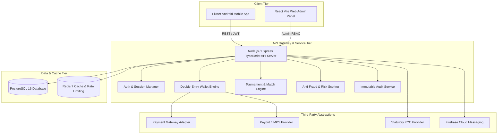

# TOURNAMENT X • System Architecture & Engineering Specifications

## 1. High-Level Architecture

Tournament X is structured as a decoupled, multi-tier enterprise platform designed for concurrent skill-based Free Fire tournaments with real-money ledger accounting and anti-fraud auditing.

---

## 2. Double-Entry Financial Ledger Mechanics

To maintain zero discrepancies and prevent balance manipulation, **wallets are never directly incremented or decremented without an immutable ledger entry**.

### Balance Categories
1. **Deposit Balance:** Cash added via UPI / Payment Gateways. Used exclusively for tournament entries.
2. **Winnings Balance:** Cash won from tournament placements and kills. Strictly eligible for bank/UPI withdrawal.
3. **Bonus Balance:** Promotional and referral bonus credits. Usable up to a platform-configured 10% on entry fees.
4. **Locked Balance:** Funds placed on temporary hold while a withdrawal request is processed through banking rails.

### Debit Prioritization on Tournament Join
When a player registers for a match:
$$\text{Bonus Deduction} = \min(\text{Bonus Balance}, \text{Entry Fee} \times 0.10)$$
$$\text{Remaining} = \text{Entry Fee} - \text{Bonus Deduction}$$
$$\text{Deposit Deduction} = \min(\text{Deposit Balance}, \text{Remaining})$$
$$\text{Winnings Deduction} = \text{Remaining} - \text{Deposit Deduction}$$

If the total available balance is lower than the entry fee, the transaction immediately rolls back with an `INSUFFICIENT_BALANCE` error.

---

## 3. End-to-End Core Flows

### FLOW A: Registration & Statutory Verification
1. Player enters mobile number / email $\to$ 6-digit OTP generated with rate limiting (max 1/min).
2. Password hashed with Argon2/bcrypt (cost factor 10).
3. Player completes profile (State, DOB, FF UID, Free Fire IGN).
4. Statutory KYC submitted: PAN / Aadhaar / Passport masked and encrypted.
5. Geo-blocking engine automatically validates player state against restricted list (`Andhra Pradesh, Assam, Nagaland, Odisha, Sikkim, Telangana`).

### FLOW B: Tournament Joining & Double-Charge Protection
1. Concurrency check ensures `current_participants < max_participants`.
2. Validates user age $\ge 18$ and active account status.
3. Wallet debit executed atomically with unique idempotency key `REG-<tournId>-<userId>`.
4. Assigned unique registration number and slot number.

### FLOW C: Custom Room Release & Prize Ledger
1. Room ID and password remain hidden until exactly 15 minutes before scheduled match start.
2. Only confirmed registered players receive credentials.
3. Post-match: Player submits kill count, placement rank, and screenshot proof.
4. Admin/Referee reviews submitted screenshot, verifies scoring points:
   $$\text{Total Points} = (\text{Kills} \times 10) + \text{Placement Points}$$
5. Winner prize amounts credited directly to `WINNINGS` balance with immutable ledger entries.

### FLOW D: Add Money & Payment Gateway
1. Server creates order with unique `order_id` and idempotency key.
2. User completes payment via UPI / Netbanking / Card.
3. Webhook listener verifies HMAC SHA256 signature before crediting `DEPOSIT` balance.

### FLOW E: Withdrawal
1. Mandatory prerequisite: KYC status must equal `VERIFIED`.
2. 2% statutory processing fee calculated:
   $$\text{Net Payout} = \text{Amount} - (\text{Amount} \times 0.02)$$
3. Amount moved atomically from `winnings_balance` to `locked_balance`.
4. Disbursed via UPI or IMPS; on rejection, automatically refunded back to `winnings_balance`.
